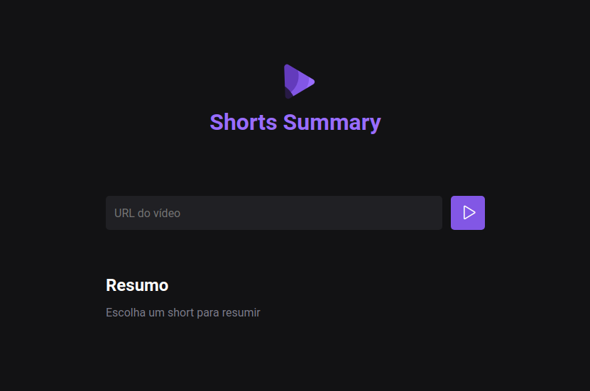

<h1 align="center">SHORTS SUMMARY</h1>
<h3 align="center">Um projeto desenvolvido na NLWIA da Rocketseat, onde é construido uma aplicação usando IA, que realiza resumos de shorts do youtube!</h3>

<h1>
<h3 align="center">🔹Para ver o projeto em funcionamento seguir os seguintes passos:🔹  
                     🔸 Faça o clone do projeto na sua máquina;  
                     🔸 Necessário ter o Node.js instalado na sua máquina;  
                     🔸 Iniciar o projeto com "npm rum web";  
                     🔸 Iniciar o backend com "npm rum server";  
                     🔸 E por fim só colocar um link válido de um short e acompanhar o andamento pelo back.
</h3>
